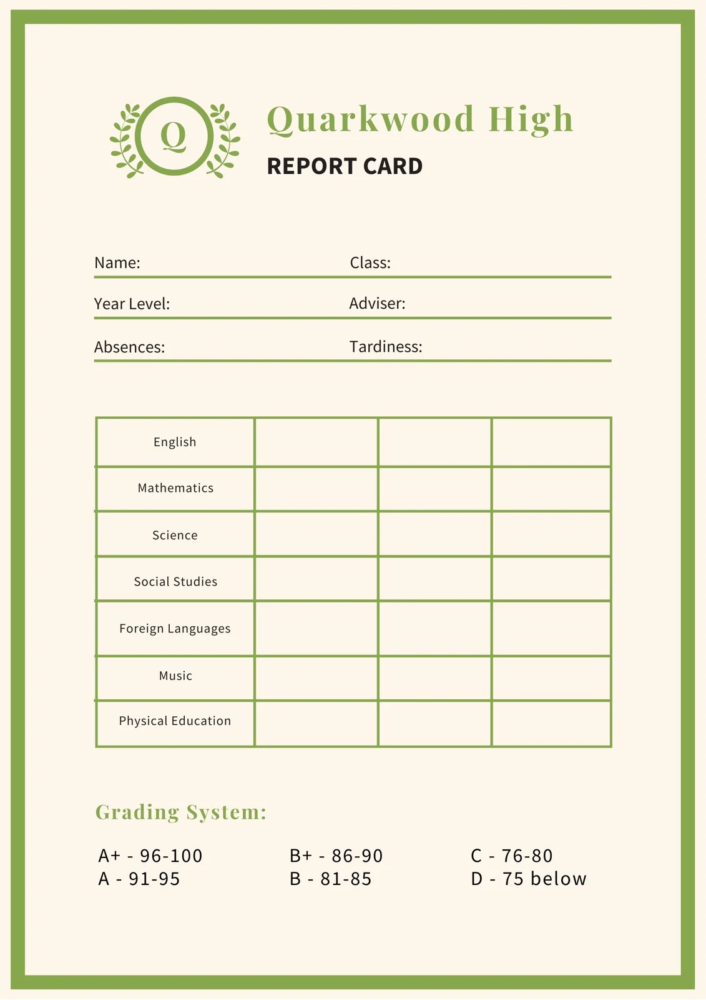

# report card

## about project
In this project, we simulated the grades of several students and obtained the highest grade, the lowest grade, and the average grade of each class.

## developers

 - Shayan Mahmoudi
 - Mobin Mahzoun Zadeh
 
 ## Advantages
It has the ability to add more numbers that still works correctly if a student or grade is added.